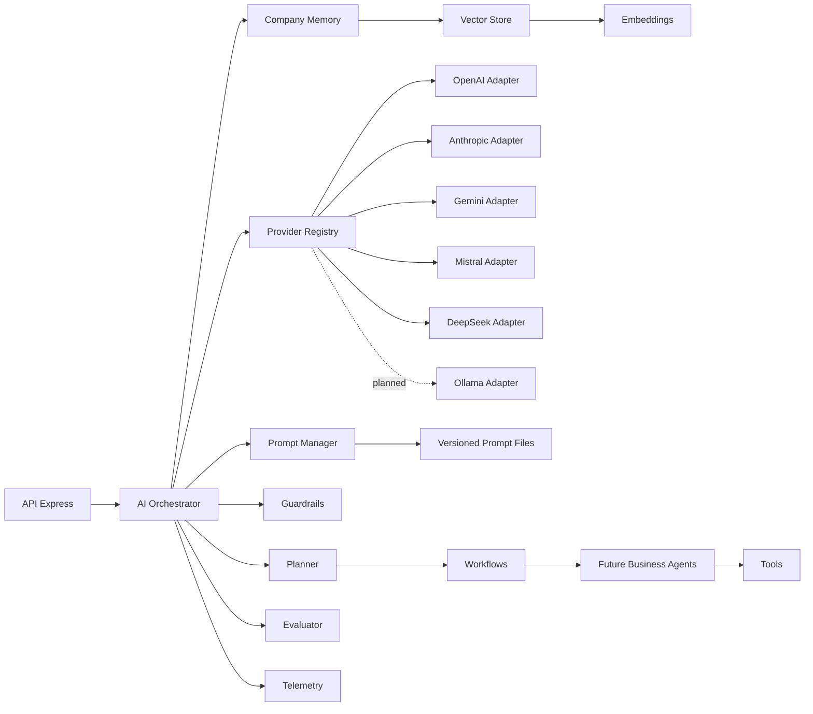

# AI Core — architecture

## Objectif

Le AI Core est une bibliothèque serveur autonome. Il assemble la mémoire de l’entreprise, planifie, rend un prompt versionné, sélectionne un provider, applique les guardrails, évalue la sortie et enregistre la télémétrie. Il n’importe ni Express, ni Prisma, ni Supabase : ces technologies seront utilisées par des adaptateurs externes.

## Diagramme



## Pipeline

1. Valider la demande avec les guardrails d’entrée.
2. Charger obligatoirement la mémoire de l’organisation.
3. Construire un plan séquentiel, parallèle ou DAG.
4. Charger une version explicite du prompt depuis les fichiers.
5. Résoudre le provider configuré dans le registre.
6. Exécuter chaque tâche et appliquer les guardrails de sortie.
7. Agréger et évaluer la qualité des sorties.
8. Retourner score, violations, tokens et coût estimé.
9. Enregistrer début, succès ou erreur de chaque appel modèle.

Le chargement de la mémoire avant le provider est garanti par l’orchestrateur et couvert par un test.

## Arborescence

```text
packages/ai/
├── prompts/
│   └── catalog/core/task/v1.json
├── src/
│   ├── agents/
│   ├── embeddings/
│   ├── evaluator/
│   ├── guardrails/
│   ├── memory/
│   ├── orchestrator/
│   ├── parsers/
│   ├── planner/
│   ├── prompts/
│   ├── providers/
│   ├── shared/
│   ├── telemetry/
│   ├── tools/
│   ├── vector-store/
│   └── workflows/
├── package.json
├── README.md
└── tsconfig.json
```

## Interfaces publiques

- `AiProvider` : génération normalisée et disponibilité d’un modèle.
- `ProviderRegistry` : enregistrement runtime et découverte des providers.
- `PromptSource` : chargement d’un prompt par clé et version.
- `CompanyMemoryProvider` : mémoire tenant-aware et recherche.
- `Planner` : décomposition d’un objectif en tâches dépendantes.
- `ResponseEvaluator` : scoring multi-critères.
- `Guardrail` : validation d’entrée ou sortie avec violations typées.
- `AiTelemetry` : collecte indépendante de la destination d’observabilité.
- `VectorStore` et `EmbeddingProvider` : recherche sémantique découplée.
- `AiTool`, `AiWorkflow` et `Agent` : extensions métier futures.
- `AiOrchestrator` : façade du pipeline complet.

Toutes sont exportées par `@communicationos/ai`.

## Providers

Les manifestes réservent identifiants, capacités et variables de configuration pour OpenAI, Anthropic, Google Gemini, Mistral AI, DeepSeek et Ollama. Ils restent `planned` tant qu’un adaptateur réseau testé n’est pas livré.

Un adaptateur concret doit implémenter `AiProvider`, convertir le contrat normalisé vers le SDK, normaliser réponses et erreurs, calculer les coûts à partir d’une table tarifaire versionnée, puis être enregistré au démarrage de l’API. Aucun SDK fournisseur n’est une dépendance du noyau.

## Prompts

Les prompts de production résident dans `prompts/catalog/<namespace>/<name>/vN.json`. Une exécution demande toujours une version explicite. Le texte des prompts ne doit apparaître ni dans les routes, ni dans les agents, ni dans l’orchestrateur ; les chaînes des tests sont uniquement des fixtures.

## Mémoire

Chaque appel porte `organizationId` et `workspaceId`. Les catégories standard couvrent identité de marque, ton, produits, services, FAQ, documents, historique et préférences. Un futur adaptateur combinera PostgreSQL, Supabase Storage, embeddings et vector store tout en maintenant l’isolation par organisation.

## Guardrails et évaluation

Les guardrails composables couvrent format, contenu interdit, sécurité, conformité, hallucinations et ton de marque. Une violation bloquante interrompt le pipeline ; un warning accompagne le résultat. L’évaluation reste distincte : elle mesure la qualité et pourra déclencher une future boucle de révision.

## Télémétrie

La télémétrie normalise fournisseur, modèle, durée, tokens, coût, correlation ID et erreur. Son port pourra cibler PostgreSQL, OpenTelemetry ou un service externe sans modifier l’orchestrateur.

## Points d’extension

- Provider : implémenter `AiProvider` et l’enregistrer.
- Prompts : implémenter `PromptSource`.
- Mémoire : implémenter `CompanyMemoryProvider` et éventuellement `VectorStore`.
- Validation : ajouter un `Guardrail` au pipeline.
- Planification : implémenter `Planner`.
- Évaluation : implémenter `ResponseEvaluator`.
- Observabilité : implémenter `AiTelemetry`.
- Agent métier : implémenter `Agent` sans modifier le noyau.

## Choix techniques

- Injection par constructeur pour rendre les dépendances explicites et testables sans réseau.
- Ports et adaptateurs pour isoler SDK et infrastructure.
- Types normalisés pour messages, tokens, coûts, erreurs et contexte.
- Versions explicites des prompts pour reproductibilité et auditabilité.
- Contexte tenant obligatoire pour isoler la mémoire dès la conception.
- Télémétrie par appel pour mesurer exactement coûts, latences et erreurs.
- Aucun fallback provider implicite : le changement de modèle peut affecter coût, conformité et qualité ; toute politique de fallback sera explicite dans un workflow.
